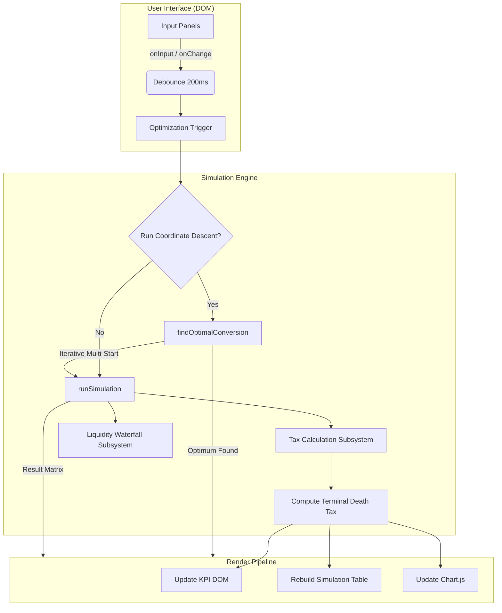
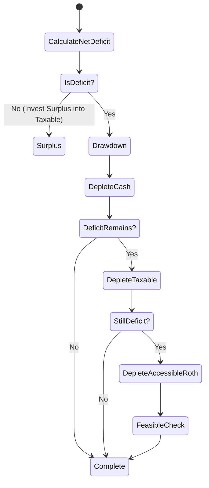

# System Architecture Blueprint: Lifetime Financial & Tax Optimization Engine

**Document Purpose:** This specification provides an unambiguous, expert-level architectural blueprint for an autonomous agent to identically replicate the 100% client-side `index.html` application. It defines strict deterministic business logic, layout constraints, and algorithmic tolerances. Do not treat this as a changelog; treat it as the absolute source of truth for generating the application.

## 1. System Topology & Constraints

- **Single-File Delivery:** All HTML, CSS (Scoped/Grid/Flex), and ES6+ JavaScript must be unified in a single `index.html` payload. No build pipelines, no Node.js backend.
- **Dependency Sandboxing:** Use `Chart.js` via CDN. Ensure offline resilience (graceful degradation via fallback warnings if CDN fails).
- **Security & Privacy:** The application computes entirely in-browser. Zero PII transmission.

## 2. Core Architecture Diagram

## 3. The Decumulation & Liquidity Waterfall

The simulation executes year-by-year from `(Current Year + 1)` through `EOL Year`. It enforces strict sequence-of-returns and liquidity drawdowns.

- **IRS 5-Year Lockup Logic:** Accessible Roth principal is governed by a strict FIFO vintage queue. Conversions made before age 59½ are locked for exactly 5 years. Once the individual hits age 59½, the entire Roth balance immediately un-vests and becomes 100% liquid.
- **RMD Enforcement:** Triggered precisely at age 75 via Uniform Lifetime Table III divisors. Forced distributions must be swept into Taxable Brokerage if unspent.

## 4. Multi-Phase Optimization Algorithm (Coordinate Descent)

The core intellectual property is the heuristic optimizer that minimizes lifetime tax (Raw or PV) across 4 distinct phases of retirement.

1. **Phase 1 (Pre-Retirement & Lockup):** `startYear` to `retireYear + 4` (or Age 59½).
2. **Phase 2 (Pre-59½ Unlocked):** `retireYear + 5` to Age 59½ (bypassed if retiring late).
3. **Phase 3 (Post-59½ Liquid):** Age 59½ to Age 74.
4. **Phase 4 (RMD Active):** Age 75+.

**Solver Mechanics:**
- **Coarse Sweep:** 4D vector grid search at $25K increments to establish a global minimum basin.
- **Medium Refinement:** $\pm$ $30K bound around the coarse vector at $5K increments.
- **Fine Refinement:** $\pm$ $5K bound around the medium vector at $1K increments.
- **Feasibility Constraint:** Any vector resulting in End-of-Life Liquidity $<$ Minimum Safety Net is penalized with an `Infinity` score.

## 5. View Layer & State Management

- **DOM Event Binding:** Use deterministic pure JavaScript `document.getElementById` mappings.
- **Empty State Gracefulness:** If critical variables are missing (`NaN`), the simulation engine must pass a mock 36-year empty vector. The table renders empty dashed cells (`-`) and the Chart.js dataset maps to `null` to retain axis rendering without plotting zeroes.
- **Chart.js Specifications:** 
  - Left Y-Axis: `$1M` rounding formatting.
  - Right Y-Axis: `$1.0M` fractional formatting.
  - Data mapping must strictly respect the `isMissing` empty-state flag to prevent artifacting.
