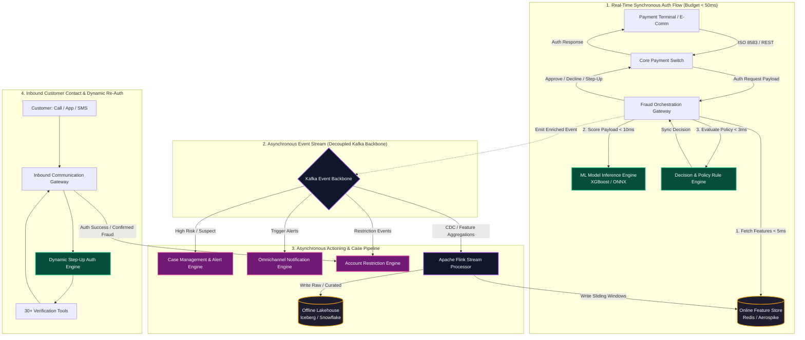
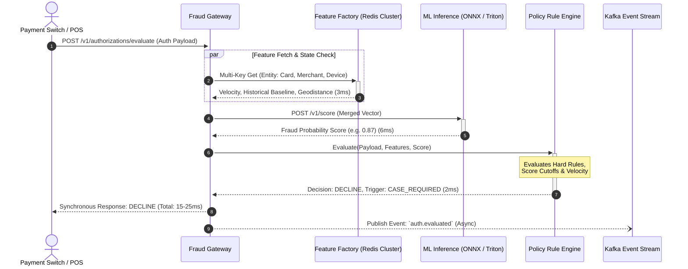
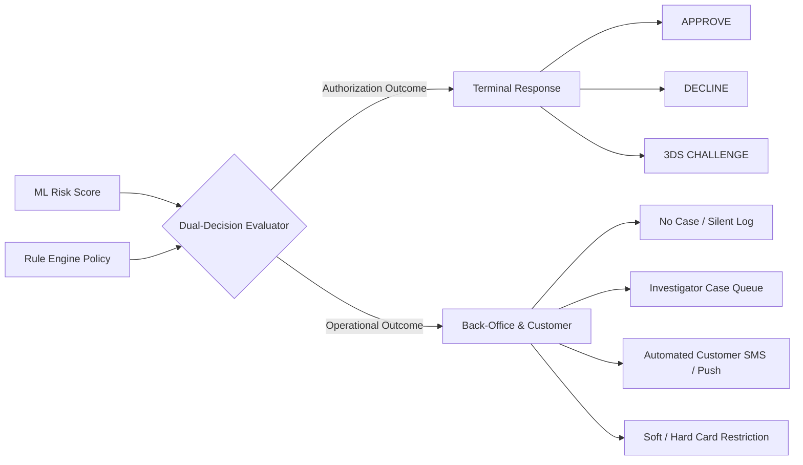
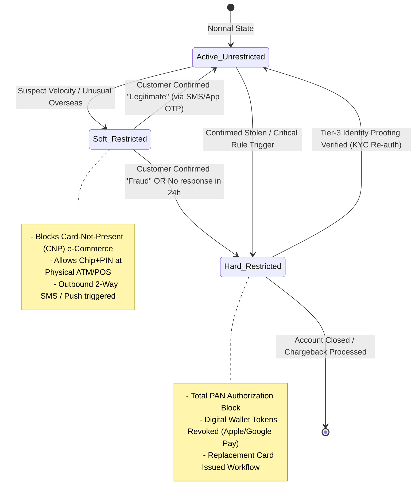
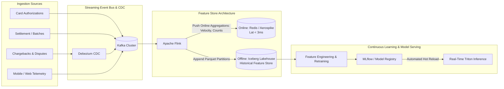

# Enterprise Credit Card Fraud Detection & Prevention Ecosystem Architecture

## 1. Executive Architecture Overview

This architecture is built for high-throughput, sub-50ms real-time card authorization decisioning, dual-path outcome routing (Synchronous Decline vs. Asynchronous Case Management), account restriction lifecycles, and a dynamic 30+ tool customer re-authentication matrix.



---

## 2. Real-Time Authorization & Feature Factory Architecture

### Synchronous vs. Asynchronous Boundary
* **Synchronous Path (In-Line, SLA < 50ms p99):**
  * Gateway receives transaction payload (PAN token, Amount, MCC, Merchant ID, Terminal Type, Geo/IP, 3DS flags).
  * Gateway queries the **Online Feature Factory** (low-latency key-value cache).
  * Gateway passes enriched vectors to **ML Inference Service** (LightGBM/XGBoost via ONNX).
  * Model score + raw attributes fed to the **Decision & Policy Rule Engine**.
  * Immediate return: `APPROVE`, `DECLINE`, or `CHALLENGE_3DS`.
* **Asynchronous Path (Off-Line, Event-Driven via Kafka):**
  * Full transaction event, feature snapshot, model scores, and rule match metadata are published to Kafka.
  * Downstream consumers handle **Case Creation**, **Notification Dispatch**, **Account State Locking**, and **Feature Store Updating**.



---

## 3. Dual-Decision Matrix (Decline vs. Case)

Every authorization undergoes dual-state evaluation:

| Quadrant | Model Score | Rule Trigger | Action to Terminal | Action to Operations / Customer |
| :--- | :--- | :--- | :--- | :--- |
| **Q1: Clean / Low Risk** | Low (< 0.20) | No rules fired | **APPROVE** | None. Standard ledger clearing. |
| **Q2: Soft Suspect** | Moderate (0.20 - 0.70) | First-time overseas / High Velocity | **APPROVE / STEP-UP** | **CASE GENERATED + 2-Way SMS Notification**. |
| **Q3: High-Risk Alert** | High (0.70 - 0.90) | Multiple Card-Not-Present spikes | **DECLINE** | **CASE GENERATED + Soft Restriction + Push/SMS Alert**. |
| **Q4: Critical / Confirmed Fraud**| Very High (> 0.90)| Stolen List / Impossible Travel Velocity | **DECLINE** | **HARD RESTRICTION (Card Freeze) + Urgent Case + Immediate Call/SMS**. |



---

## 4. Infrastructure Sizing for 100 TPS (with 3x Peak Sizing = 300 TPS)

### Traffic & Latency SLA Specs
* **Nominal Throughput**: 100 Transactions Per Second (~8.64 Million/day).
* **Peak Design Capacity (3x Headroom)**: 300 TPS.
* **Latency Budget (P99)**: **< 40ms** inside the fraud ecosystem.

```
+-------------------------------------------------------------------------+
| TOTAL FRAUD SERVICE LATENCY BUDGET (40ms P99)                           |
+-------------------+-------------------+-------------------+-------------+
| Gateway / Network | Feature Store MGet| Model Inference   | Rule Engine |
| 3 - 5 ms          | 3 - 6 ms          | 5 - 10 ms         | 2 - 4 ms    |
+-------------------+-------------------+-------------------+-------------+
```

### Component-by-Component Infrastructure Sizing Table

| Tier | Component | Sizing & Spec | Redundancy / HA | Projected Utilization @ 300 TPS |
| :--- | :--- | :--- | :--- | :--- |
| **Ingress** | API Gateway / Envoy Proxy | 2x `c6i.large` (2 vCPU, 4GB RAM) | Multi-AZ (Active-Active) | CPU < 15% |
| **Orchestration** | Fraud Gateway Microservice (Go / Rust / Java Quarkus) | 3x `c6i.xlarge` (4 vCPU, 8GB RAM) | Multi-AZ with HPA (Auto-scale) | CPU < 25%, P99 Latency ~2ms |
| **Online Feature Store** | Redis Cluster / Aerospike | 3 Primary + 3 Replica Shards (`r6g.large`, 13GB RAM each) | Multi-AZ, In-Memory Persistence | IOPS < 5%, Cache Hit > 99.8% |
| **ML Inference Service** | ONNX Runtime / Triton Inference Server | 3x `c6i.2xlarge` (8 vCPU, 16GB RAM) | CPU thread pooling (No GPU needed for tabular models) | P99 < 8ms |
| **Rule Engine** | Embedded Drools / Custom JSON-Logic Engine | In-process or 2x `c6i.xlarge` | Embedded sidecar in Gateway | P99 < 2ms |
| **Message Streaming**| Apache Kafka (AWS MSK / Confluent) | 3 Brokers (`m5.large`, 2 vCPU, 8GB RAM, 500GB gp3) | 3-AZ, Replication Factor = 3 | Throughput ~5MB/sec (Minimal load)|
| **Stream Processing**| Apache Flink / Spark Streaming | 2 JobManagers + 4 TaskManagers (`c6i.xlarge`) | RocksDB State Store checkpointing to S3 | Continuous sliding aggregation |

---

## 5. Account Actioning & Restriction State Machine

When risk is detected, the ecosystem issues both communications and dynamic restrictions:



### Omnichannel Communication Engine
1. **2-Way Interactive SMS**: Immediate trigger (`"Did you try $450 at Merchant X? Reply 1=Yes, 2=No"`).
2. **In-App Mobile Push Notification**: Rich biometric challenge inside mobile banking app.
3. **Outbound IVR / Automated Voice Call**: Escalation if SMS fails to deliver within 5 minutes.
4. **Email Notification**: Detailed summary of suspect activity with dispute links.
5. **Physical Mailer / Regulatory Notice**: Generated for adverse action notices (FCRA / regulatory compliance).

---

## 6. Inbound Customer Re-Authentication Matrix (30+ Tool Catalog)

When a customer contacts the institution (or responds to an alert), the **Dynamic Step-Up Auth Engine** determines the verification level based on current account restriction level and interaction channel.

```mermaid
flowchart TD
    Inbound[Customer Inbound Channel:\nCall Center / IVR / Mobile App / Web / Branch] --> Context[Context & Risk Profiler\nANI/Caller-ID Match, Device Fingerprint, SIM-Swap Check]
    
    Context --> RiskEngine{Determine Auth Tier Needed}
    
    RiskEngine -->|Tier 1: Low Friction| T1[Tier 1: Automated Low Friction]
    RiskEngine -->|Tier 2: Medium Friction| T2[Tier 2: Step-Up Challenge]
    RiskEngine -->|Tier 3: High Friction| T3[Tier 3: Full Identity Proofing]
    
    subgraph T1Tools ["Tier 1: Fast Verification (Self-Service / Frictionless)"]
        T1 --> A1[1. In-App Push Biometric]
        T1 --> A2[2. SMS One-Time Passcode - OTP]
        T1 --> A3[3. Voice Biometrics - Passive Call Stream]
        T1 --> A4[4. Behavioral Biometrics - Typing/Swipe]
        T1 --> A5[5. Silent Network Auth - Carrier OAuth]
        T1 --> A6[6. Device Hardware Token / Secure Enclave]
        T1 --> A7[7. Card PIN - In-Person / IVR]
        T1 --> A8[8. Email Magic Link / OTP]
        T1 --> A9[9. Card CVV2 / Expiry Verification]
        T1 --> A10[10. Last 4 Digits of SSN / Tax ID]
    end

    subgraph T2Tools ["Tier 2: Elevated Verification (Call Center / High-Risk Action)"]
        T2 --> B1[11. Dynamic KBA - Knowledge-Based Questions]
        T2 --> B2[12. Recent Transaction Verification Matrix]
        T2 --> B3[13. Linked Bank Account Micro-Deposit Check]
        T2 --> B4[14. MNO Real-Time SIM-Swap & Porting Age Check]
        T2 --> B5[15. Inbound Carrier ANI spoofing validation - STIR/SHAKEN]
        T2 --> B6[16. Secondary Emergency Contact OTP]
        T2 --> B7[17. FIDO2 / WebAuthn Hardware Security Key]
        T2 --> B8[18. Out-of-Band Callback Verification]
        T2 --> B9[19. WhatsApp Verified Business OTP]
        T2 --> B10[20. Mobile Device Geolocation Proximity Match]
    end

    subgraph T3Tools ["Tier 3: High Friction / Account Unfreeze / Identity Proofing"]
        T3 --> C1[21. Single Gov ID Scan - Driver License OCR + Barcode]
        T3 --> C2[22. 3-Document Package - ID + Utility Bill + Bank Stmt]
        T3 --> C3[23. Live 3D Facial Liveness & Selfie Matching]
        T3 --> C4[24. Video KYC Agent Interview with Geo-tagging]
        T3 --> C5[25. Credit Bureau Soft Inquiry & Credit File Match]
        T3 --> C6[26. Social Security Administration e-CBSV Check]
        T3 --> C7[27. In-Branch Physical ID Inspection & Notary]
        T3 --> C8[28. Passport Chip NFC Reading & Cryptographic Validation]
        T3 --> C9[29. Utility Account Direct API Verification - Plaid/MX]
        T3 --> C10[30. Device Forensic Certificate Re-Issuance]
    end

    T1Tools & T2Tools & T3Tools --> ResultEval{Verification Result}
    ResultEval -->|Pass| Unlock[Clear Case & Lift Restrictions]
    ResultEval -->|Fail| Escalation[Escalate to Fraud Investigator & Freeze]
```



---

## 7. Data Architecture & Event Streaming Backbone


