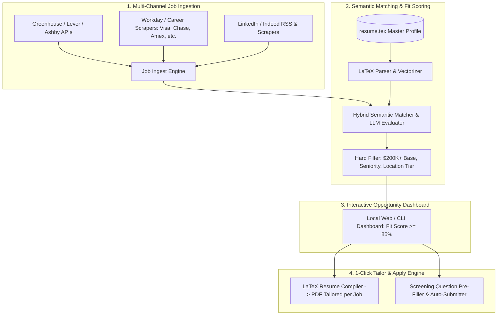

# Intelligent Job Search & Application Co-Pilot: System Requirements & Specs

## 1. Candidate Target Profile & Preferences
* **Candidate**: Zhe "Eric" Zhang (`zhe.eric.zhang@gmail.com`) &bull; Richmond, VA
* **Target Roles / Titles**:
  * Director / Senior Director / Head of Card Fraud Risk & Decision Systems
  * Director / Head of Data Science & Risk Analytics
  * Principal / Staff Technical Product Manager – Fraud & Decision Platforms
  * Principal / Lead Risk & Decision Architect
  * Senior Manager (if compensation & scope meet the high bar)
* **Seniority / Experience Level**: Executive / Director / Lead (18+ years progressive leadership at Capital One)
* **Work Arrangement / Location**:
  * **Tier 1 (Top Preference)**: 100% Remote (US) OR Richmond, VA metro
  * **Tier 2**: Northern Virginia / DC Metro (NOVA / Tysons / McLean / Reston / Arlington)
  * **Tier 3**: Open to relocation for exceptional leadership / high-compensation opportunities
* **Target Compensation**:
  * **Base Salary**: **$200K+ USD**
  * **Total Compensation (Base + Bonus + Equity)**: **$275K - $450K+ USD**
* **Work Authorization**: US Citizen / Green Card (No sponsorship constraint)

---

## 2. Target Employers & Industry Verticals

### A. Payment Networks & Card Schemes
* **Visa** (CyberSource, Risk & Fraud Solutions)
* **Mastercard** (NuData Security, Brighterion, Risk Analytics)
* **American Express** (Risk & Fraud Management, Decision Science)
* **Discover Financial Services** / DFS

### B. Major Card Issuers & Enterprise Financial Institutions
* **JPMorgan Chase** (Card & Merchant Fraud, Decision Sciences)
* **Citigroup** (Global Consumer Bank Fraud & Risk)
* **Bank of America** (Payment Fraud & Cyber Risk)
* **Wells Fargo** (Enterprise Fraud Risk Management)
* **U.S. Bank** (Payment Services & Card Fraud)
* **Barclays US Consumer Bank** (Card Risk & Fraud)
* **Synchrony Financial** (Retail Card & Credit Fraud)
* **Ally Financial**, **Capital One Alumni Network**, **Goldman Sachs (Platform/Card)**

### C. Credit Bureaus, Identity & Fraud Tech Platforms
* **Credit Bureaus**: Experian (CrossCore), Equifax, TransUnion (TruValidate)
* **Fraud Risk Platforms**: LexisNexis Risk Solutions, Early Warning Services (EWS/Zelle), FICO
* **Modern Fraud / Identity AI Platforms**: Socure, Sift, Sardine, Alloy, Feedzai, Forter, Kount

### D. High-Growth Fintech & Payment Processors
* **Stripe** (Radar / Risk Engineering), **Block / Square** (Risk Systems), **Adyen**, **PayPal**, **Ramp**, **Brex**, **Plaid**, **Chime**

---

## 3. System Architecture & Capabilities

---

## 4. Technical Stack & Local Tooling
* **Language**: Python 3.14
* **LaTeX Compilation**: `/Library/TeX/texbin/pdflatex` (Local native compilation)
* **Storage & Indexing**: SQLite + `sqlite-vec` or local JSON Vector embeddings (zero cloud dependency needed)
* **Scraping & Ingestion**: `httpx`, `BeautifulSoup4`, `playwright`
* **Local UI Dashboard**: Clean Tailwind + FastAPI / Streamlit or lightweight single-page HTML interface
